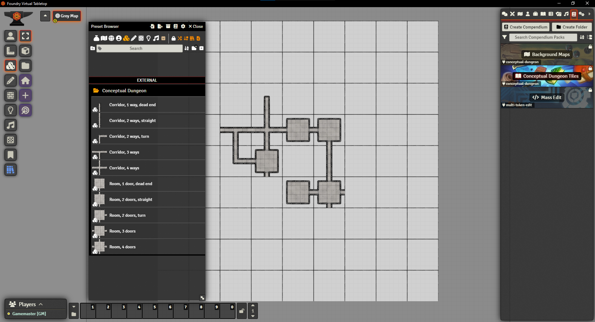

# Conceptual Dungeon Foundry VTT Module

## How to install

Install manually the latest build by pasting this manifest url: https://github.com/JordanRR/conceptual-dungeon/releases/latest/download/module.json

This module contain a series of tiles and a scene to place them on. It all works like geomorphs. Each tile is fully walled, thanks to the Mass Edit module by Baileywiki. The tiles can be used without it but won’t have walls.

This is meant to build a "conceptual dungeons", where each tile is meant to symbolize a meaningful chunk of content, not visually represent it. Right now, there are “rooms” with 1 to 4 “doors” and “corridors” with 1 to 4 “ways”. I may add new tiles in the future.

This module is perfect for solo play. It is also a great tool for GMs, giving them a way to structure their players' exploration and track their progress using fog of war.

Thank you!

Jordan, Abacus Tabletop Games

## Contact me

[Blog](https://abacustabletopgames.bearblog.dev/)

[Email](abacus.tabletop.games@gmail.com)

## Attributions, etc.

Tiles built with Dungeondraft and the following packs: 

* neovatar's "oldschool" [map pack](https://github.com/neovatar/oldschool-neovatar) (oldschool-neovatar) (c) 2023 by Thomas Seliger (neovatar). Licensed under [CC BY 4.0](https://creativecommons.org/licenses/by/4.0/)
